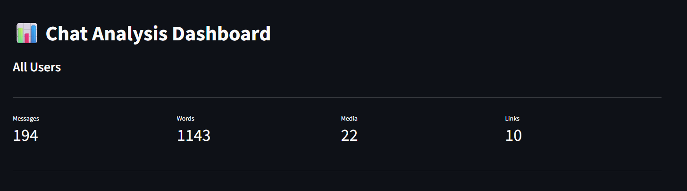
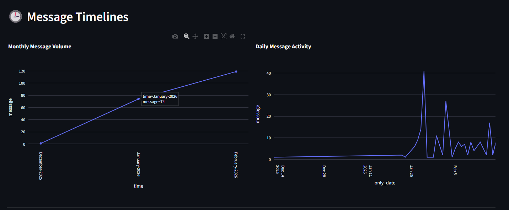
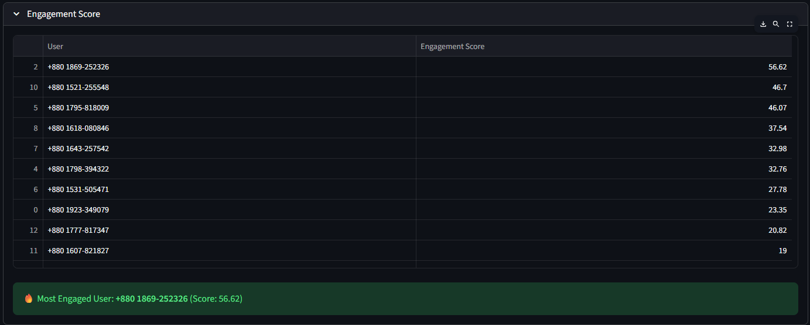
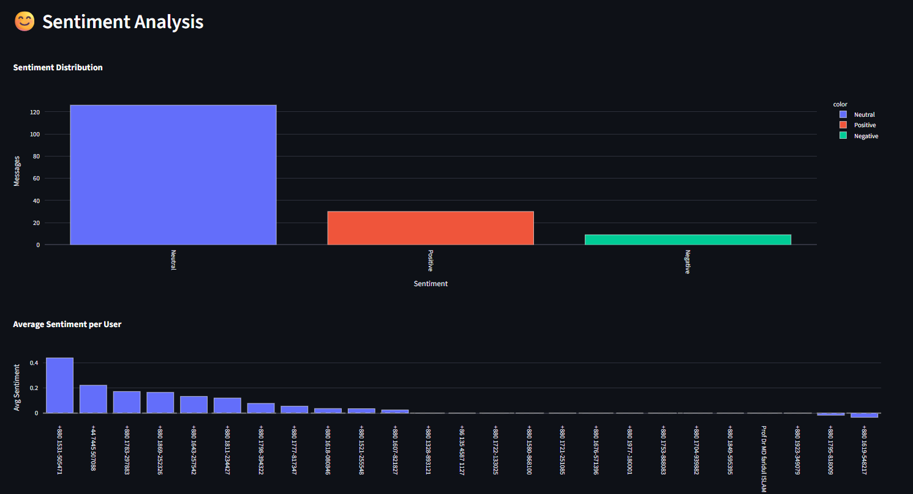
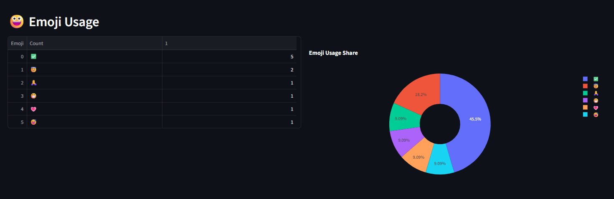

# 📊 WhatsApp Chat Analyzer
### 🚀 AI-Powered Behavioral & Sentiment Analytics Dashboard

An interactive **Streamlit**-based analytics platform that transforms exported WhatsApp chat data into deep behavioral insights using Data Science and Natural Language Processing (NLP).

## 🌍 Live Demo
Experience the app in action:
👉 **[View Live Dashboard](https://your-app-name.streamlit.app)** *(Replace with your actual app link)*

---

## 🧠 Project Overview

This application analyzes WhatsApp chat exports (`.txt` format) to provide a comprehensive suite of analytics, moving beyond simple message counts to perform behavioral and emotional analysis.

**Key Capabilities:**

*   📈 **Message Activity Trends:** Analyze communication patterns over time.
*   👥 **User Behavioral Profiling:** Generate detailed profiles for each participant.
*   🔥 **Engagement Score Ranking:** Quantify and rank user engagement with a custom scoring model.
*   😊 **Sentiment Analysis:** Detect the emotional tone (positive, neutral, negative) of messages.
*   ☁️ **Word Cloud Visualization:** Visually represent the most frequently used words.
*   😀 **Emoji Usage Analysis:** Explore emoji frequency and distribution.
*   📊 **Interactive Charts & Heatmaps:** Dynamic visualizations for deep dives.


| Dashboard Overview | Timeline Analysis |
| :---: | :---: |
|  |  |

| Engagement Score Ranking | Sentiment Analysis |
| :---: | :---: |
|  |  |

| Emoji Usage Analytics |
| :---: |
|  |

## 🛠️ Tech Stack

| Category | Tools & Libraries |
| :--- | :--- |
| **Language** | Python |
| **Web App Framework** | Streamlit |
| **Data Processing** | Pandas |
| **Visualization** | Plotly, Matplotlib, Seaborn |
| **NLP (Sentiment)** | NLTK (VADER) |
| **Utilities** | WordCloud, URLExtract, Emoji |

## 📂 Project Structure
📁 whatsapp-chat-analyzer/
│
├── app.py # Main Streamlit application
├── helper.py # Core analysis functions
├── preprocess_text.py # Text cleaning and preprocessing
├── requirements.txt # Python dependencies
├── nltk.txt # NLTK data dependencies
│
├── screenshots/ # Folder for application screenshots
│ ├── dashboard.png
│ ├── timeline.png
│ ├── engagement.png
│ ├── sentiment.png
│ └── emoji.png
│
└── README.md # Project documentation (this file)


## ✨ Features (Version 1)

#### 🔹 Chat Statistics
*   Total Messages, Word Count, Media Count, and Link Count.

#### 🔹 Timeline Analysis
*   Monthly and Daily activity trends.
*   Interactive line charts for visualizing communication patterns over time.

#### 🔹 Activity Heatmap
*   A `Day × Hour` matrix heatmap to visualize weekly behavioral patterns and peak activity times.

#### 🔹 User Behavior Profiling
A comprehensive profile for each user, including:
*   Messages per Day
*   Average Words per Message
*   Emoji Usage Ratio
*   Media & Link Sharing Ratio
*   Night Activity Ratio
*   Most Active Hour & Day

#### 🔹 Engagement Score System
Users are ranked using a **weighted normalized model** to create a behavioral engagement leaderboard:
*   **30%** Total Messages
*   **20%** Messages per Day
*   **20%** Avg. Words per Message
*   **10%** Emoji Usage
*   **10%** Media Ratio
*   **10%** Link Ratio

#### 🔹 Sentiment Analysis (NLP)
*   Utilizes the **VADER** sentiment analyzer to classify messages as Positive, Neutral, or Negative.
*   Calculates the average sentiment score per user.

#### 🔹 Word Cloud
*   Dynamically generates a word cloud to visually highlight the most frequent words in the chat.

#### 🔹 Emoji Analytics
*   Emoji Frequency Table.
*   Emoji Usage Pie Chart.
*   Emoji Share Distribution among users.

## 📥 How to Use

**Step 1: Export Your WhatsApp Chat**
*   Open the WhatsApp chat you wish to analyze.
*   Tap the `⋮` (three dots) menu > `More` > `Export Chat`.
*   Choose **`Without Media`** for a faster, text-only export.

**Step 2: Upload and Analyze**
*   Open the [web application](#-live-demo).
*   Upload the exported `.txt` file.
*   Select a specific user or "Overall" for analysis.
*   Click the **`Analyze Chat`** button.

## 💻 Run Locally

Follow these steps to set up the project on your local machine.

1.  **Clone the Repository**
    ```bash
    git clone https://github.com/YOUR_USERNAME/whatsapp-chat-analyzer.git
    cd whatsapp-chat-analyzer
    ```

2.  **Install Dependencies**
    It's recommended to use a virtual environment.
    ```bash
    pip install -r requirements.txt
    ```

3.  **Run the App**
    ```bash
    streamlit run app.py
    ```

## 🌍 Deployment

This application is deployed using:
*   **Streamlit Community Cloud:** For hosting the web app.
*   **GitHub Integration:** For automatic deployments from the repository.

## 🔮 Future Improvements (Version 2)

We are planning to introduce AI-level smart features to make the analysis even more insightful:

*   **Advanced Emotion Classification:** Detect specific emotions like Joy, Anger, Sadness, and Love.
*   **Chat Personality Prediction:** Infer communication styles and personality traits.
*   **AI Chat Summary Generator:** Automatically generate a summary of long conversations.
*   **Response Time Analysis:** Calculate average response times between users.
*   **Conversation Starter Detection:** Identify users who initiate the most conversations.
*   **Downloadable PDF Report:** Export the entire analysis as a professional PDF.

## 📈 What This Project Demonstrates

*   **Text Preprocessing:** Cleaning and structuring raw, unstructured chat data.
*   **Behavioral Analytics Modeling:** Creating metrics and profiles to quantify user behavior.
*   **Custom Scoring System:** Designing and implementing a weighted engagement score.
*   **NLP Application:** Practical use of sentiment analysis on real-world text data.
*   **Interactive Dashboard Design:** Building a user-friendly and dynamic data application.
*   **Cloud Deployment Workflow:** Deploying a project from a GitHub repository to a public cloud platform.


If you found this project useful or interesting, please consider giving it a star on GitHub! Your support is greatly appreciated.
